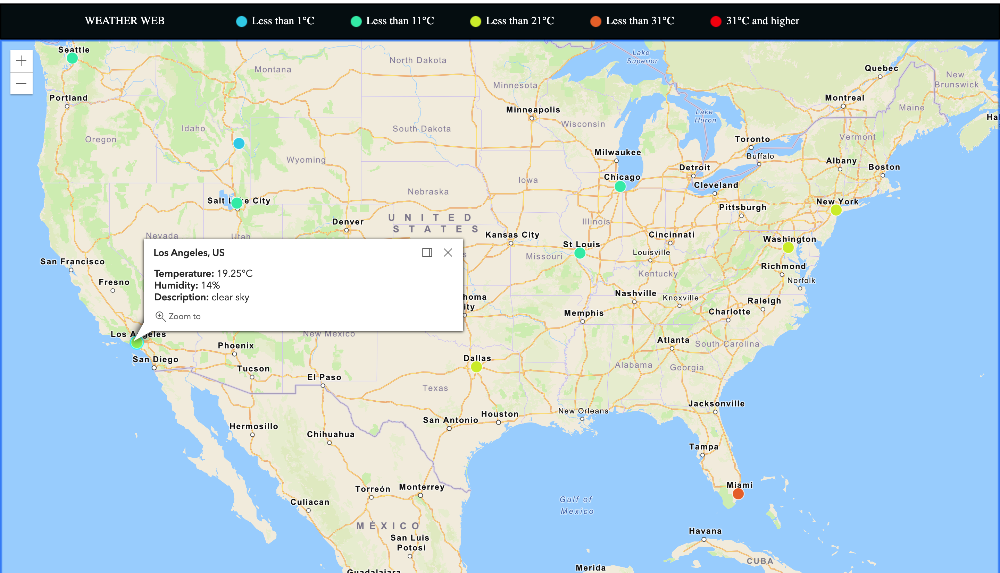
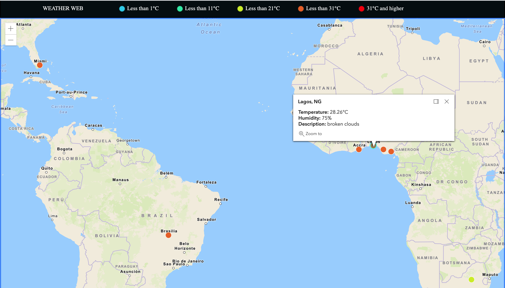

# OVERVIEW
This website displays weather report of different cities around the world on an ARCGIS map. It gets the required data, such as temperature, location, and so forth from an API server. Designed with JavaScript, CSS, and HTML.
It uses Visual Studio Code, ARCGIS map library, API from OpenWeather, and github.

# DEVELOPMENT ENVIRONMENT
* Visual Studio Code
* Google Chrome

# EXECUTION
To execute the program: run the file on a web browser.

# USEFUL WEBSITES
* [ArcGis Developer Tutorials/Doc](https://developers.arcgis.com/labs/browse/?product=javascript&topic=any)
* [w3schools JavaScript Tutorials](https://www.w3schools.com/js/)
* [w3schools CSS Tutorials](https://www.https://www.w3schools.com/css/default.asp)
* [w3schools HTML Tutorials](https://www.https://www.w3schools.com/html/default.asp)

